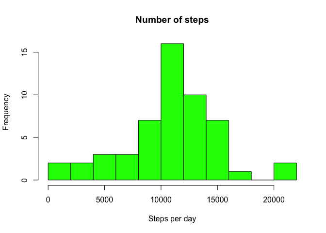
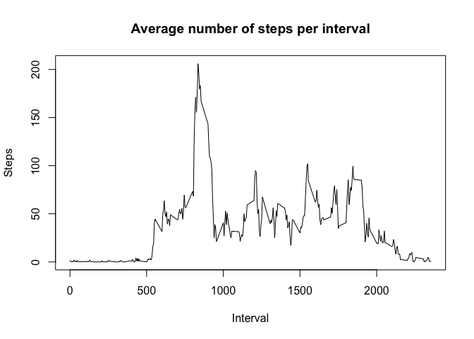
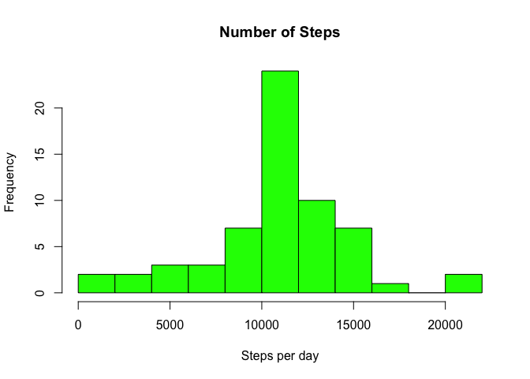
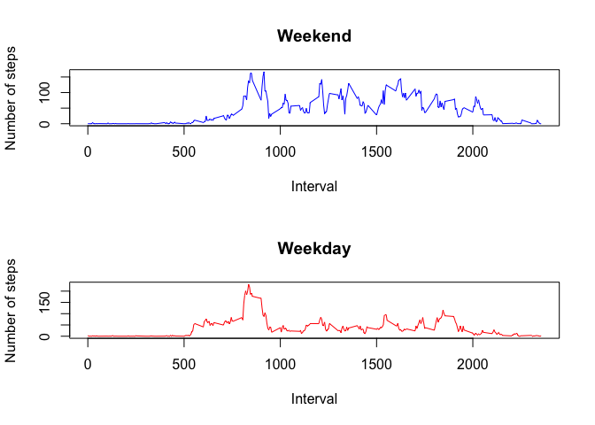

# Reproducible Research: Peer Assessment 1


## Loading and preprocessing the data
Load the file "activity.csv" from the zip archive "activity.zip".


```r
activity <- read.csv(unz("activity.zip", "activity.csv"), sep=",", colClasses = c("numeric", "character", "numeric"))
```

Explicitly convert column "date" to **Date** data type


```r
activity$date <- as.Date(activity$date)
```
## What is mean total number of steps taken per day?
For this part of the assignment, we can ignore the missing values in the dataset

1. Calculate the total number of steps taken per day


```r
stepsPerDay <- aggregate(activity$steps, by=list(activity$date), FUN=sum, na.rm=F)
```

2.  Display the histogram of the total number of steps taken each day


```r
hist(stepsPerDay$x, main="Number of steps",
     xlab="Steps per day", col="green", breaks = 10)
```

 

3. Calculate and report the mean and median of the total number of steps taken per day

```r
stepsDayMean <- mean(stepsPerDay$x, na.rm=T)
stepsDayMedian <- median(stepsPerDay$x, na.rm=T)
```
The mean of steps taken per day is 10766 and the median is 10765

## What is the average daily activity pattern?
1. Make a time series plot (i.e. type = "l") of the 5-minute interval (x-axis) and the average number of steps taken, averaged across all days (y-axis)


```r
avgNStepsPerInterval <- aggregate(activity$steps, by=list(activity$interval), FUN=mean, na.rm=T)
names(avgNStepsPerInterval) <- c("interval", "mean")

plot( x=avgNStepsPerInterval$interval,
      y=avgNStepsPerInterval$mean,
      type="l",
      main="Average number of steps per interval",
      ylab="Steps",
      xlab="Interval")
```

 

2. Which 5-minute interval, on average across all the days in the dataset, contains the maximum number of steps?


```r
maxStepsInterval <- avgNStepsPerInterval[which.max(avgNStepsPerInterval$mean), "interval"]
```

The interval 835 contains maximum steps

## Imputing missing values

1. Calculate and report the total number of missing values in the dataset (i.e. the total number of rows with NAs)

The total number of missing values is: 2304

2. Devise a strategy for filling in all of the missing values in the dataset. The strategy does not need to be sophisticated. For example, you could use the mean/median for that day, or the mean for that 5-minute interval, etc.

Replace each missing value with the mean value of its 5-minute interval

```r
completeA <- activity
completeA$steps <- mapply(function(steps, interval) {if (!is.na(steps)) return (steps) else return (avgNStepsPerInterval[avgNStepsPerInterval$interval == interval, "mean"]) }, completeA$steps, completeA$interval)
```

3. Make a histogram of the total number of steps taken each day and Calculate and report the mean and median total number of steps taken per day. Do these values differ from the estimates from the first part of the assignment? What is the impact of imputing missing data on the estimates of the total daily number of steps?


```r
completeStepsPerDay <- aggregate(completeA$steps, by=list(completeA$date), FUN=sum, na.rm=F)
hist(completeStepsPerDay$x, main="Number of Steps",
     xlab="Steps per day", col="green", breaks = 10)
```

 

The mean of steps taken per day for complete data is 10766 and the median is 10766

There is no significant changes in mean and average values, because NA values were replaced with values based on the mean values of the interval. And it's absolutely clear, added values influenced on the total number of steps per day.

## Are there differences in activity patterns between weekdays and weekends?

1. Create a new factor variable in the dataset with two levels – “weekday” and “weekend” indicating whether a given date is a weekday or weekend day.

```r
completeA$day <- ifelse(weekdays(completeA$date) %in% c("Saturday", "Sunday"),"weekend", "weekday")
```
2. Make a panel plot containing a time series plot (i.e. type = "l") of the 5-minute interval (x-axis) and the average number of steps taken, averaged across all weekday days or weekend days (y-axis). See the README file in the GitHub repository to see an example of what this plot should look like using simulated data.

```r
par(mfrow=c(2,1))
averages <- aggregate(steps ~ interval + day, data=completeA, mean)
plot( x=averages[averages$day == 'weekend', "interval"],
      y=averages[averages$day == 'weekend', "steps"],
      type="l",
      col=124,
      main="Weekend",
      ylab="Number of steps",
      xlab="Interval")

plot( x=averages[averages$day == 'weekday', "interval"],
      y=averages[averages$day == 'weekday', "steps"],
      type="l",
      col=554,
      main="Weekday",
      ylab="Number of steps",
      xlab="Interval")
```

 
